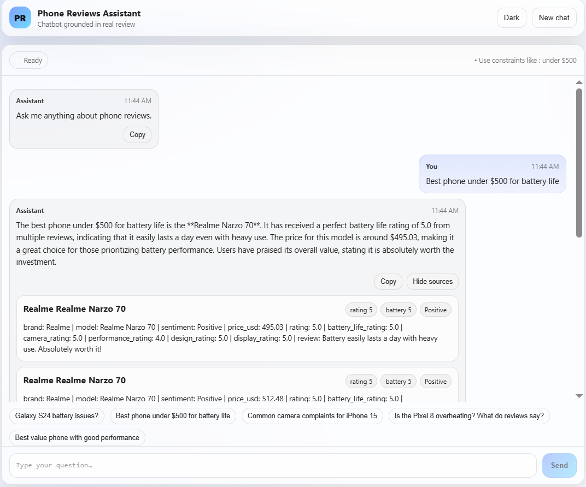
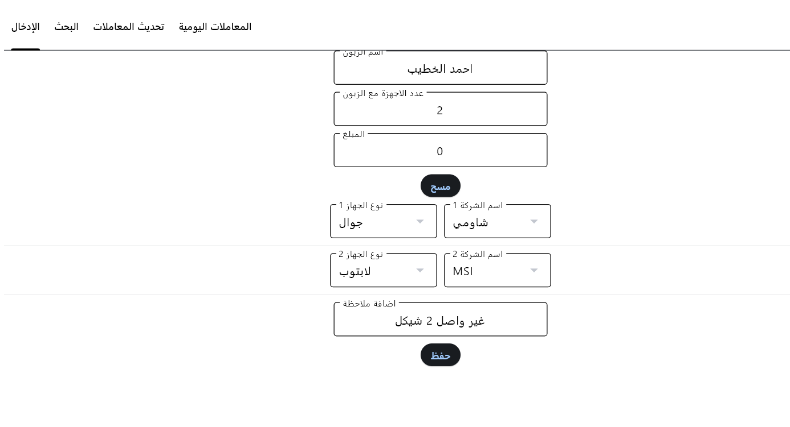

<!-- PROFILE HEADER -->
<h1 align="center">Ahmed I. Alkhateeb</h1>

<b>AI Engineer · Data Science Student</b>

📍 Gaza, Palestine · 🎓 UCAS (Expected 2026)

<!-- SOCIAL BOXES (COLORED BADGES) -->

  
  
  
  

---

## About
I build practical AI systems with a focus on **Machine Learning, NLP, and Retrieval-Augmented Generation (RAG)** — from data processing and modeling to deployment and user-facing apps.

---

## Core Skills
- **ML:** Scikit-learn, XGBoost, SVM, classification/regression  
- **NLP:** preprocessing, embeddings, transformer basics  
- **Data:** pandas, NumPy, EDA, feature engineering  
- **Apps:** Streamlit, Flet  
- **Dev:** Git/GitHub, SQL, SQLite

---

## Projects

<table>
  <tr>
    <td width="50%">
      <h3>Mobile Review Intelligence </h3>
      

        A phone reviews assistant that answers questions using <b>real user reviews only</b> (RAG + LangChain + ChromaDB + Fastapi + React).
      

      

        🔗 <a href="https://intelligent-mobile-review.netlify.app/">Live Demo</a> 
        📁 <a href="https://github.com/AhmadKhtib/Phone-Reviews-RAG-Assistant">Repository</a>
      

      

        
        
        
        
        
        
      

    </td>
    <td width="50%">
      
    </td>
  </tr>
    <tr>
    <td width="50%">
      <h3>Gaza Food Market Supply & Demand Analysis</h3>
      

        Interactive dashboard for analyzing <b>food market supply and demand trends in Gaza</b>, using data collected from Telegram channels where people post buying and selling offers.
      

      

        🔗 <a href="https://market-supply-demand-analysis2025.streamlit.app/">Live App</a>
        📁 <a href="https://github.com/AhmadKhtib/supply-demand-analysis2025">Repository</a>
      

      

        
        
        
        
      

    </td>
    <td width="50%">
      <!-- Replace with your screenshot path once you add it -->
      
    </td>
  </tr>

  <tr>
    <td width="50%">
      <h3>Shahin — Charging Point Management System</h3>
      

        Business management system with <b>Python + Flet + SQLite</b>, RTL Arabic UI, and automated reporting.
      

      

        📁 <a href="https://github.com/AhmadKhtib/Shahin">Repository</a>
      

      

        
        
      

    </td>
    <td width="50%">
      
    </td>
  </tr>

  <tr>
    <td width="50%">
      <h3>IBM Employee Attrition Prediction</h3>
      

        End-to-end ML pipeline with SMOTE balancing and model comparison (XGBoost achieved <b>93.5%</b> accuracy).
      

      

        📓 <a href="https://www.kaggle.com/code/ahmadialkhatib/eda-and-classification-93-5-ibm-employee-attrition">Kaggle Notebook</a>
      

      

        
        
      

    </td>
    <td width="50%">
      
    </td>
  </tr>
</table>

---
